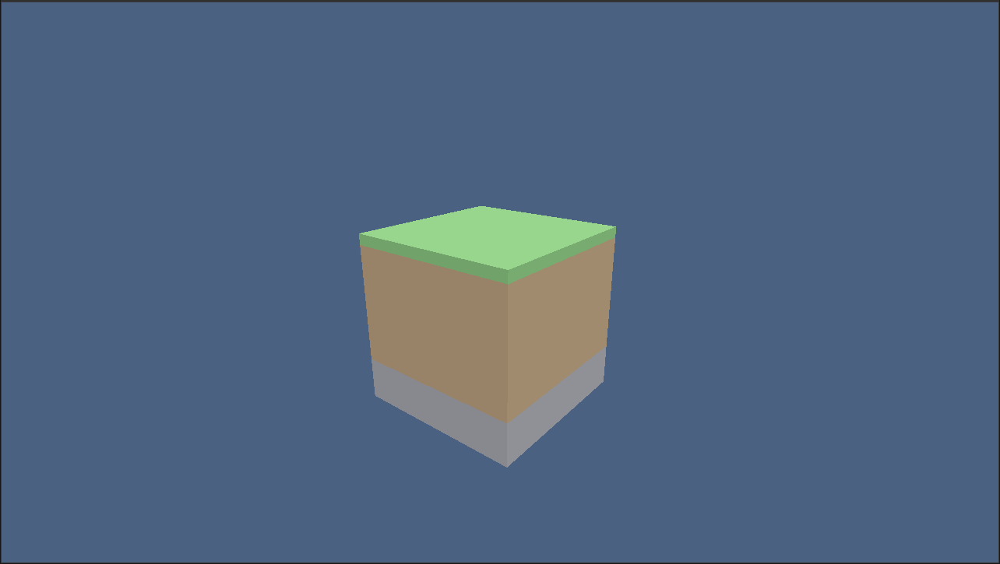

# Core Edition




**Core Edition** is an open-source, high-performance 3D voxel engine (simmilar to Minecraft) built entirely from scratch using Rust and `wgpu`. Designed for high throughput, modular architecture, and cross-platform flexibility, Core Edition bypasses third-party game engines to deliver a pure, low-level graphics pipeline.

---

## 🚀 Vision & Key Features

- **Pure Scratch Architecture:** No pre-built game engines or bloat. Built directly on raw graphics primitives and custom shaders.
- **Cross-Platform Graphics Core:** Powered by `wgpu`, delivering native performance on Vulkan, Metal, DirectX 12, and WebGPU targets.
- **Custom WGSL Shaders:** Hardware-accelerated vertex and fragment shading with directional lighting pipelines.
- **Responsive Camera & Input Controls:** Native 3D FPS camera with smooth mouse look, WASD flying mechanics, and pointer lock integration.
- **Copyleft & Patent Protected:** Licensed under GNU GPLv3 to ensure the engine remains open-source, community-driven, and permanently shielded against patent litigation.

---

## 🛠 Tech Stack

| Component | Library / Tool | Description |
| :--- | :--- | :--- |
| **Language** | [Rust](https://www.rust-lang.org/) | Memory-safe, concurrency-focused systems language |
| **Graphics API** | [`wgpu`](https://github.com/gfx-rs/wgpu) | Cross-platform, modern graphics API abstraction |
| **Windowing** | [`winit`](https://github.com/rust-windowing/winit) | Pure-Rust cross-platform window management |
| **Shaders** | WGSL | WebGPU Shading Language for vertex/fragment pipelines |
| **Math** | [`glam`](https://github.com/bitshifter/glam-rs) | Fast vector and matrix math library |

---

## ⚡ Quickstart

### Prerequisites

Ensure you have the latest stable [Rust toolchain](https://rustup.rs/) installed:

```bash
rustc --version
cargo --version
